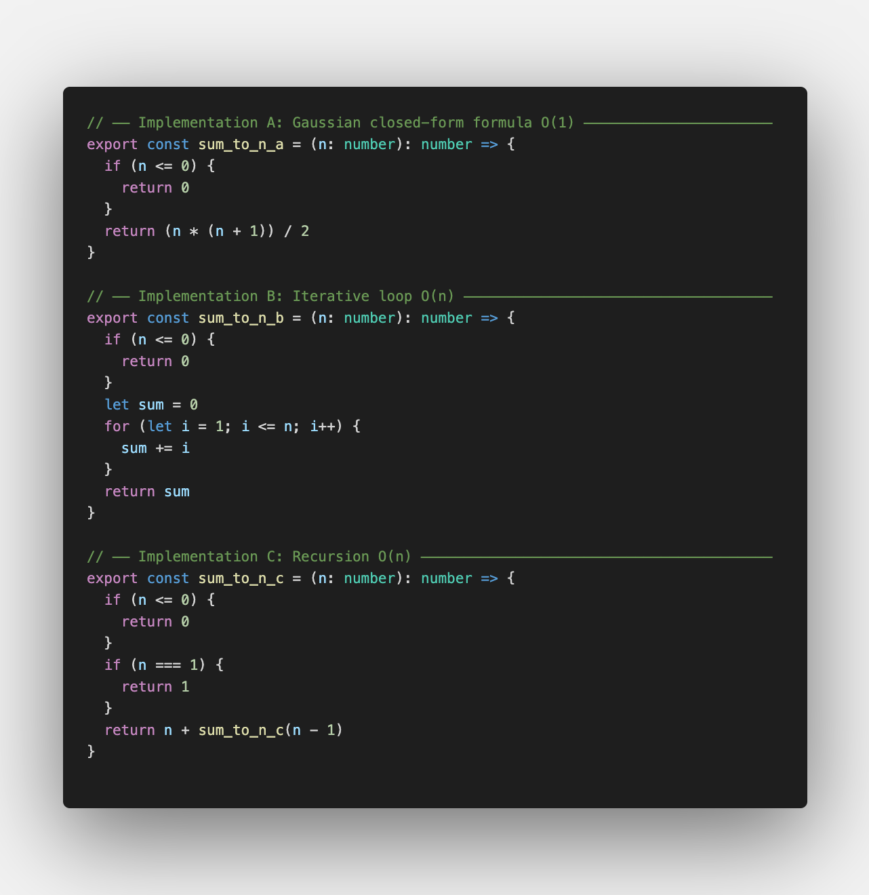
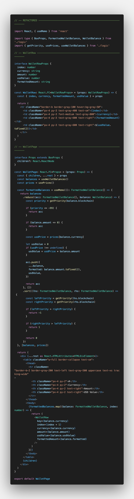

# Assessment

A React + TypeScript + Vite project for the 99tech technical assessment. The app is organized into 3 independent problems, each accessible via a tab in the UI.

## Tech Stack

- **React 19** + **TypeScript**
- **Vite 8**
- **Tailwind CSS v4** (via `@tailwindcss/vite`)
- **react-hook-form** — form validation
- **@tanstack/react-query** — async data fetching + client state
- Mock i18n utility (`src/lib/i18n.ts`)

## Project Structure

```
src/
├── components/
│   ├── Task.tsx           # Shared problem-statement card
│   └── TokenSelector.tsx  # Reusable token dropdown with icon
├── lib/
│   └── i18n.ts           # Mock i18n / translation helper
├── problems/
│   ├── problem1/         # Sum to N
│   │   ├── index.tsx
│   │   ├── solutions.ts
│   │   └── README.md
│   ├── problem2/         # Currency Swap Form
│   │   ├── index.tsx
│   │   ├── logic.ts
│   │   ├── logic.test.ts
│   │   ├── types.ts
│   │   ├── useSwapForm.ts
│   │   └── README.md
│   └── problem3/
│       ├── index.tsx
│       └── README.md
├── App.tsx               # Tab navigation
└── index.css             # Global styles + Tailwind entry
```

## Problems

### Problem 1 — Sum to N

> Provide 3 unique implementations of the following function in JavaScript.
>
> **Input**: `n` - any integer
>
> _Assuming this input will always produce a result lesser than `Number.MAX_SAFE_INTEGER`_.
>
> **Output**: `return` - summation to `n`, i.e. `sum_to_n(5) === 1 + 2 + 3 + 4 + 5 === 15`.

**Approach**

|     | Approach                     | Time | Space |
| --- | ---------------------------- | ---- | ----- |
| A   | Gaussian formula `n*(n+1)/2` | O(1) | O(1)  |
| B   | Iterative `for` loop         | O(n) | O(1)  |
| C   | Recursion `n + sum(n-1)`     | O(n) | O(n)  |



### Problem 2 — Currency Swap Form

> Create a currency swap form based on the template provided in the folder. A user would use this form to swap assets from one currency to another.
>
> _You may use any third party plugin, library, and/or framework for this problem._
>
> 1. You may add input validation/error messages to make the form interactive.
> 2. Your submission will be rated on its usage intuitiveness and visual attractiveness.
> 3. Show us your frontend development and design skills, feel free to totally disregard the provided files for this problem.
> 4. You may use this [repo](https://github.com/Switcheo/token-icons/tree/main/tokens) for token images, e.g. [SVG image](https://raw.githubusercontent.com/Switcheo/token-icons/main/tokens/SWTH.svg).
> 5. You may use this [URL](https://interview.switcheo.com/prices.json) for token price information and to compute exchange rates (not every token has a price, those that do not can be omitted).
>
> ✨ Bonus: extra points if you use [Vite](https://vite.dev/) for this task!
>
> 💡 Hint: feel free to simulate or mock interactions with a backend service, e.g. implement a loading indicator with a timeout delay for the submit button is good enough.

**Approach**

- Prices fetched via `@tanstack/react-query`; deduplicated by keeping the latest date entry per token; zero/negative prices discarded
- Exchange rate: `fromToken.price / toToken.price`; output recomputes on every keystroke
- Banker's rounding (round-half-to-even) with magnitude-adaptive decimal precision (2 dp for ≥100k, up to 8+ dp for very small values)
- Flip button swaps the two token selectors; amount stays unchanged, rate inverts automatically
- Simulated 1.5 s swap with loading spinner; last 10 swaps shown in history panel
- Network errors and HTTP errors surfaced with distinct messages; token images from the Switcheo token-icons repo

### Problem 3 — Messy React

> List out the computational inefficiencies and anti-patterns found in the code block below.
>
> This code block uses ReactJS with TypeScript, functional components, and React Hooks.
>
> You should also provide a refactored version of the code, but more points are awarded to accurately stating the issues and explaining correctly how to improve them.

**Issues identified**

| #   | Issue                                                                                                   | Category             |
| --- | ------------------------------------------------------------------------------------------------------- | -------------------- |
| 1   | `lhsPriority` used in `filter` but never declared — `balancePriority` was assigned instead              | Bug / ReferenceError |
| 2   | Filter logic inverted — keeps balances with `amount <= 0`, discards positive balances                   | Logic bug            |
| 3   | `prices` in `useMemo` dependency array but never read inside the memo                                   | Spurious dependency  |
| 4   | `getPriority` re-created on every render (defined inside component, not memoised)                       | Performance          |
| 5   | `formattedBalances` computed but `rows` iterates `sortedBalances` instead — formatted values never used | Dead computation     |
| 6   | `rows` types each element as `FormattedWalletBalance` but the source array is `WalletBalance`           | Type mismatch        |
| 7   | `balance.formatted` accessed on `WalletBalance` which has no `formatted` field                          | Runtime error        |
| 8   | `balance.amount.toFixed()` — no precision argument; produces integer string                             | Precision bug        |
| 9   | `key={index}` on a sorted list — index keys are unstable after re-sort                                  | React anti-pattern   |
| 10  | `sort` comparator has no return for equal priorities — returns `undefined` (treated as 0)               | Sort instability     |
| 11  | `blockchain` typed as `any` in `getPriority` — defeats TypeScript safety                                | Type safety          |
| 12  | Unused `children` destructured from props but never rendered                                            | Dead code            |



## Demo

<video src="video_demo.mov" controls width="100%"></video>

> Video not rendering? Download directly: [video_demo.mov](video_demo.mov)

## Getting Started

```bash
pnpm install
pnpm dev
```
